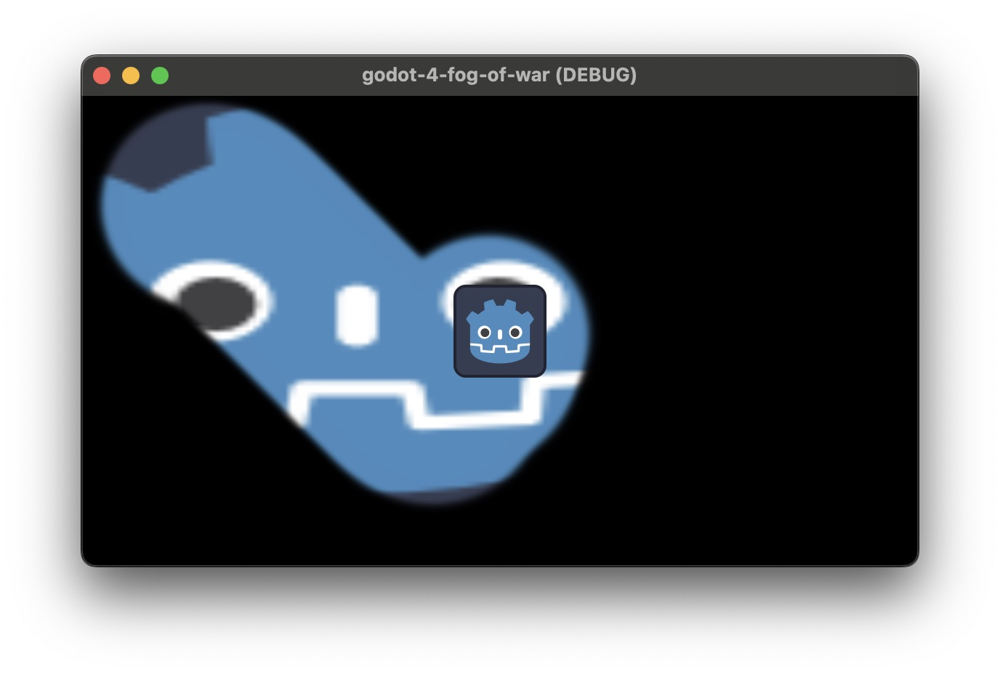

__Let's make it better:__  

#### __Rate__ 

# Fog of war for Godot 4+

#### Original author: [@uheartbeast](https://github.com/uheartbeast/godot-fow-tutorial)

## What's new
- Godot 4+ support
- Better exports for editor
- Debounce
- Optimizations (re-render only when it really needs and cache things)
- Character following example

## Video (clickable)

## How to use

### As new project

The repo itself is a ready to use Godot project.

Just [download it](https://github.com/TABmk/godot-4-fog-of-war/archive/refs/heads/master.zip) and import as new project.

Simple character with script for movement is included.

### Add to existing project
- Select your main scene Node2D object
- Attach script to it
- Copy code from [game.gd](https://github.com/TABmk/godot-4-fog-of-war/blob/master/game.gd) and paste it to your editor
- Create "light" texture. See example: [Light.png](https://github.com/TABmk/godot-4-fog-of-war/blob/master/Light.png)
- Edit code as you want
- Add Sprite2D to scene. This will be your fog
- __Disable "Centered" property under `Offset` tab on your fog object__
- __Select fog object, open `Material`, click new CanvasItemMaterial. Click on it, set `Blend mode` property to `Multiply`__

By default, it requires CharacterBody2D object.

Check `_process` and `_input` functions if you want to adapt the code for your project.

#### ⚠️ Warning
`_process` function is using a `.get_input()` method which is declared in [player.gd](https://github.com/TABmk/godot-4-fog-of-war/blob/master/player.gd) example. 